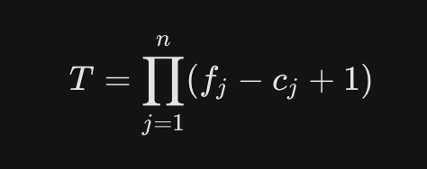

## 1. Operações Fundamentais

Em estrutura de dados, o interesse principal reside em duas operações:

* **Consulta (consul):** Retorna o valor armazenado em uma posição específica da matriz.


* **Atribuição (atrib):** Define um novo valor para uma posição da matriz. Esta pode alterar a matriz original localmente ou gerar uma nova matriz com a alteração.


## 2. Representação de Matrizes na Memória

Como a memória do computador é linear, matrizes multidimensionais precisam ser mapeadas para um vetor unidimensional através de cálculos de índice ().

### Matrizes Unidimensionais (1D)

Existem duas formas principais de representação:

* **Natural:** Onde a matriz é representada por um vetor que vai do índice inicial (`c`) ao final (`f`).


* **Baseada:** Onde a matriz começa em um endereço ou índice base (`b`).

    * **Total de elementos (`T`):** `T = f - c + 1`.


    * **Cálculo do índice (`k`):** k = b + i - c.


### Matrizes Bidimensionais (2D)

Para mapear um elemento `M[i1, i2]` em um vetor linear:

* **`t1`:** Quantidade de elementos por linha.


* **Fórmula do índice (`k`):** `k = b + t1 * (i1 - c1) + (i2 - c2)`.

---

## 3. Matrizes Especiais (Economia de Espaço)

Quando uma matriz possui um padrão de elementos nulos, podemos economizar memória armazenando apenas o que é relevante.

| Tipo de Matriz | Descrição | Estratégia de Armazenamento |
| --- | --- | --- |
| **Diagonal** | Elementos são nulos se `i != j`. | Armazena apenas os elementos da diagonal principal em um vetor.|
| **Triangular Inferior** | Elementos acima da diagonal principal (`i < j`>) são nulos.| Armazena apenas a parte inferior. O total de elementos é `n * (n + 1)/2`. |
| **Simétrica** | `M[i, j] = M[j, i]` para todo `i, j`. | Armazena apenas o triângulo inferior ou superior para economizar quase metade do espaço. |
| **Tridiagonal** | Apenas a diagonal principal e suas duas vizinhas imediatas possuem valores. | Armazena `3n - 2` elementos em posições consecutivas.|

---

## 4. Matrizes Esparsas

Uma matriz é considerada **esparsa** quando a maioria de seus elementos é igual a zero. Para evitar desperdício de memória, armazena-se apenas os elementos não nulos usando uma estrutura que guarda o índice e o valor.

**Exemplo de Estrutura em C:**

```c
typedef struct {
    int ind;   // Índice do elemento
    float val; // Valor do elemento
[cite_start]} mat_spr; [cite: 271, 274, 276, 277]

```

Neste modelo, as operações de consulta e atribuição exigem algoritmos de busca (como a função `lugar`) para encontrar se um índice já existe na lista de elementos não nulos.

---

## 5. Fórmulas Gerais para N-Dimensões

Para uma matriz `M[i1, i2, ..., in]`, o total de elementos (`T`) é o produto das variações de cada dimensão:




O cálculo do índice  para acesso linear segue a lógica de acumular o deslocamento de cada dimensão anterior.